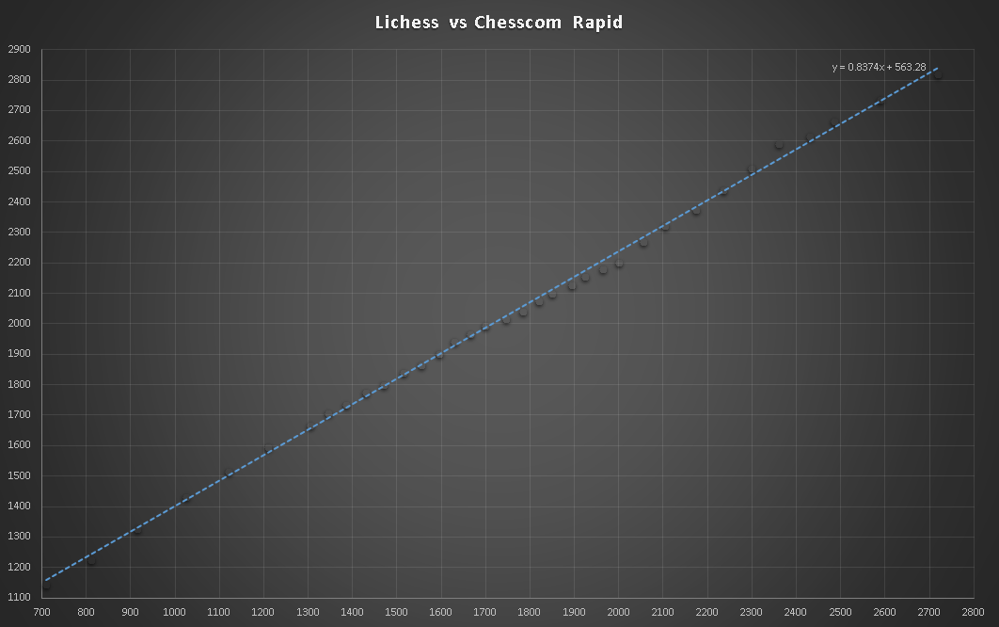
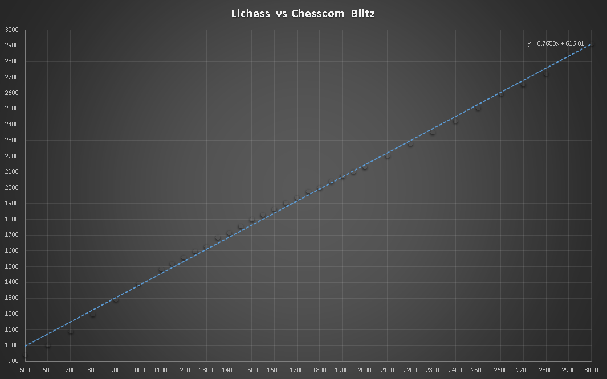
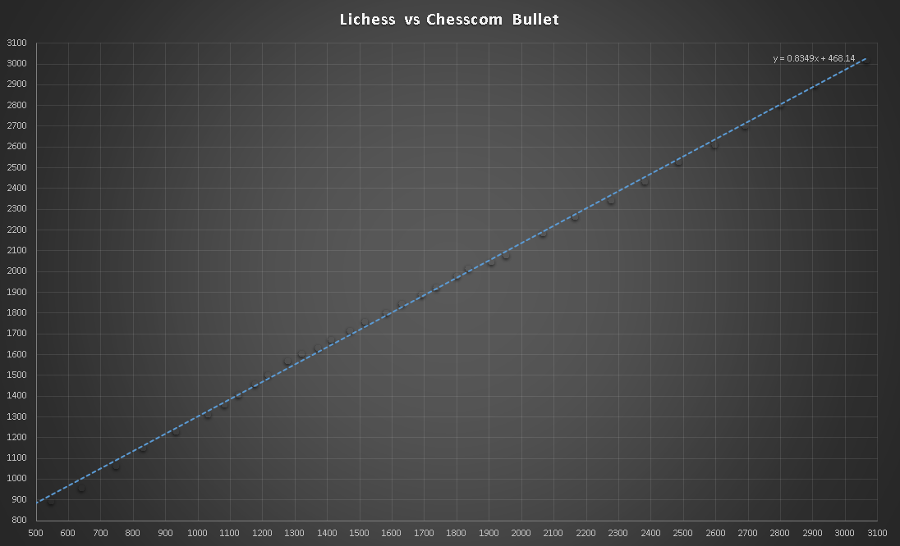

Allows to convert a chess rating between chesscom, lichess, FIDE and USCF.

Available at https://paul2t.github.io/chess-rating-converter/

This is based on the data provided by https://chessgoals.com/rating-comparison/

Here are some graphs showing the correlation between lichess and chesscom.
Lichess is the vertical axis, chesscom is the horizontal axis.

